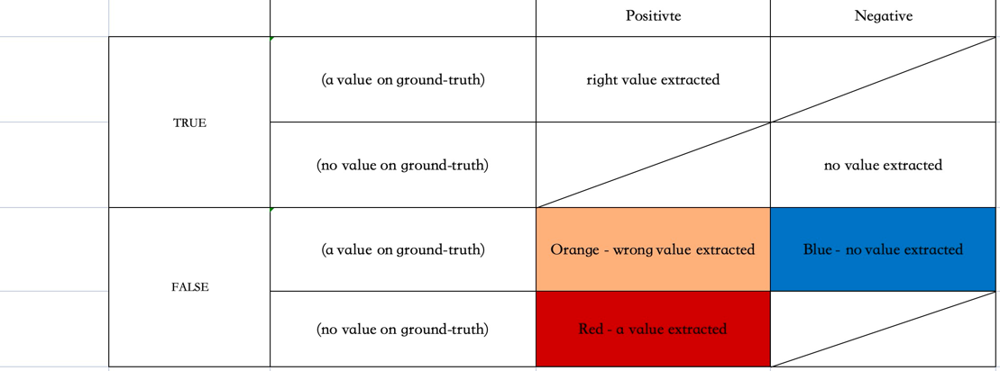
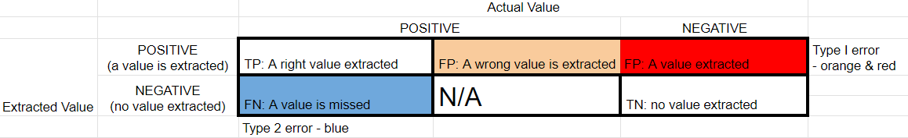
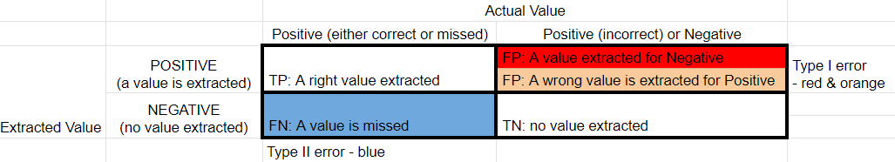

## Metadata
- **Author**: Zhenlin Chen
- **Email**: [Zhenlinc@Stanford.edu]
- **Created**: Oct-4-2023
- **Updated**: Oct-18-2023

## Instructions

1. **Environment**: 
    
    - This program is designed to run on Linux, and has been tested on Ubuntu 22.04.1 LTS.
    - If you do not have a linux machine, You may [install WSL(Windows Subsystem for Linux) on your Windows](https://www.wwwinsights.com/best-way-install-linux-on-windows/)
    - If you use Macbook, you may install Ubuntu 22.04 LTS through [virtual box](https://ubuntu.com/tutorials/how-to-run-ubuntu-desktop-on-a-virtual-machine-using-virtualbox#1-overview). Follow the tutorial step by step to finish the installation.
    
2. **Verify Python and Pip**: 
    
    - Verify you have correct version of Python. It should be above 3.10.
    ```bash
    python3 --version
    ```
    - Verify you have pip3 installed. 
    ```bash
    which pip3
    ```
    If it does not show anything, install pip3 if you uses Ubuntu.
    ```bash
    sudo apt-get install python3-pip
    ```
    Or you may manually install and refer [here](https://stackoverflow.com/questions/6587507/how-to-install-pip-with-python-3).
    
3. **Python Virtual Environment**: 
    - Setup a python virtual environment named `opgee`.
    - [Follow this tutorial on setting up a Python virtual environment](https://www.wwwinsights.com/lang/python/how-to-use-python-virtual-environment/). Preferably, use `virtualenvwrapper`.
    - Switch to the `opgee` environment using the command:
      ```
      workon opgee
      ```
      Ideally, put the above line at the end of you ~/.bashrc file, so you do not need to mannually switch everytime.

4. **Repository Setup**: 
    - Clone this repository in your home directory or any directory you prefer.
    ```
    
    git clone https://github.com/Richardczl98/OPGEE-LLM-Training.git
    
    cd OPGEE-LLM-Training
    ```
    If you do not have a Github personal access token, please [apply one following this tutorial](https://www.wwwinsights.com/github-repository-collaborator/).

5. **Install Python libraries**: 
    - Navigate to the deploy directory and install the necessary packages by following [Python Development Environment Setup Instructions](./deploy/README.md)


6. **Create .env**
    - Ask the admin to give you .env file. Please note its filename starts with a dot. It looks like the below example but with real values.
    ```bash
    PROJECT='opgee'
    OPENAI_API_KEY='your openai api key'
    ANTHROPIC_API_KEY='your claude api key'
    AZURE_OPENAI=True
    AZURE_OPENAI_API_KEY='ask admin for the key'
    AZURE_OPENAI_API_BASE='ask admin for the endpoint. e.g. https://xyz.openai.azure.com/'
    AZURE_OPENAI_API_VERSION='2023-08-01-preview check azure API doc if you would like higher version'
    AZURE_OPENAI_GPT-4-DEPLOYMENT_NAME='ask admin for the name'
    AZURE_OPENAI_GPT-3dot5-DEPLOYMENT_NAME='ask admin for the name'
    ```
    Please never check in your .env to the repo.

7. **Run the CLI**
    - Use `-h` to learn how to run the cli.
    ```bash
    python opgee_cli.py -h
    ```
    e.g. a possible call is
    ```bash
    python opgee_cli.py -p ./data/zips/spe-115712-ms.zip -m gpt-4 -g ./data/spe/SPE-115712-ms.xlsx
    ```
    These testing zip and xlsx are checked in the repo, and you shall be able to run it.
    The results are placed in ./result/paper-name/time-model/. It contains the following file.
  - `paper-name.log`

  - `extract.xls`

  - `extract_ref.xls`

  - `eval_matrix.png`  (if ground truth is provided)

  - `eval_matrix_report.txt` (if ground truth is provided)

  - `cost.txt` (if openAI model is used)

    If you want to display and evaluate the model successfully extracted values in extract.xlsx.  Please add `-so` parameter. 

    ```bash
    python opgee_cli.py -p ./data/zips/spe-115712-ms.zip -m gpt-4 -g ./data/spe/SPE-115712-ms.xlsx -so
    ```

    

8. **Evaluate the results**
    The below table is our definition of TP/TN/FP/FN. Please note this is NOT a confusion matrix.

    The below table is the confusion matrix that using the definitions above. 

    There is another version of the confusion matrix that maybe a little bit eaiser to be understood. 

    We look at some metrics defined below.

    |metric|definition|notes|
    |------|----------|-----|
    |TP%   |TP/(TP+FP+FN)| Not standard metric. Since our TN is usually very large, this is used to replace accuracy sometimes.|
    |FP%| FP/(TP+FP+FN)|The lower the better. High value means model tends to have hallucination. Type 1 red error is worse than type 1 orange, which is worse than type 2 blue error in our extraction. High value of type-2-orange error means model's reasoning is not correct. We differ type-1-red & type-1-orange errors in extract-ref.xlsx, but has not count them seperately to caculate any metrics.|
    |FN%| FN/(TP+FP+FN)| The lower the better. High value of type-2-blue error means model is too conservative to make extraction|
    |TPR/recall|TP/(TP+FN)=TP/P|Standard metric. For a given POSITIVE, the probability that can be extracted correctly. If we want the papers to be extracted as much as possible, we need to observe this value closely.|
    |FPR|FP/(FP+TN)=FP/N|For a given NEGATIVE, the probability that turns into an type-1 error. This might be used to reflect hallucination.|
    |TNR|TN/(FP+TN)=TN/N| = 1- FPR; for a given NEGATIVE, the probability that it'll be correctly extracted. |
    |FNR|FN/(TP+FN)=FN/P| = 1 - recall; a given POSITIVE, the probability it'll be a type-2 error.|
    |Accuracy|(TP+TN)/(N+P)|standard metric. Usually ver high since our TN is very large comparing with TP. |
    |Accuracy*|=TP%|not a standard metric|
    |Precision|TP/(TP+FP)|standard metric; when there is a POSITIVE extraction, the probability that this extraction is right. From a data consumer perspective, this shall be the most important metric.|
    |F1|`2*recall*precision/(recall+precision)`|The standard metric to show the balance between recall and precision.|


9. **Demo Script**  
demo.sh will run spe-115712-ms, spe-210009-ms and spe-28002-ms in one shot.
 ```bash
  git pull
  bash script/demo.sh
 ```

 10. **More sample CLIs**
  ```bash
python opgee_cli.py -p ./data/zips/spe-115712-ms.zip -m gpt-4 -g ./data/spe/SPE-115712-ms.xlsx
python opgee_cli.py -p ./data/zips/spe-210009-ms.zip -m gpt-4 -g ./data/spe/SPE-210009-ms.xlsx
python opgee_cli.py -p ./data/zips/spe-28002-ms.zip  -m gpt-4 -g ./data/spe/SPE-28002-ms.xlsx
python opgee_cli.py -p ./data/zips/spe-179612-ms.zip  -m gpt-4 -g ./data/spe/SPE-179612-ms-WL.xlsx
python opgee_cli.py -p ./data/zips/spe-9478-pa.zip  -m gpt-4 -g ./data/spe/spe-9478-pa-RZ.xlsx
python opgee_cli.py -p ./data/zips/spe-38926-ms.zip  -m gpt-4 -g ./data/spe/spe-38926-ms_intermediate.xlsx
python opgee_cli.py -p ./data/zips/iptc-18834-ms.zip  -m gpt-4 -g ./data/iptc/iptc-18834-ms_intermediate.xlsx


  ```

 11. **Playground**

      There are a few seperate CLIs provieded to give users flexibility to run various task. 

      - Prepare a Paper

      The first step is to convert a pdf to the zip format so we can get it further parsed it into txt files, because the model can only accept text.
      Always use -h to check how CLI works.

     ```bash
     python script/prepare_paper.py -h
     ```

     A possible example is as follows.

      ```bash
     python script/prepare_paper.py -p data/spe/spe-87016-ms.pdf
      ```

     The above command generate the paper's zip format to result/spe-87016-ms/spe-87016-ms.zip. It also saves an unzipped directory for the content.

     It also generates the txt format of the paper in result/spe-87016-ms/txt. It contains paper.txt(all pages), paper-1.txt(the first page), ..., paper-n.txt(the last page). If you notice there is a txt file named paper-15-18.txt, that means there is a big table spanning these pages, and they have to be always processed together.

     Please refrain to use this command now, since there is a 500/month limit with the current key. We'll need multiple keys in the production mode later.

     Once you have prepared a paper, **you can use only paper name to refer to this paper**, and do not need to provide any path or file extension.

     - Show Tokens

     This command gives you an idea the number of tokens of each page (or pages if they cannot be sperated) so that you can plan accordingly for next steps. 
     Always use -h to check how CLI works.

     ```bash
     python script/show_tokens.py -h
     ```

     A possible example is as follows.

     ```bash
     python script/show_tokens.py -p spe-87016-ms -m gpt-4
     ```

     For all gpt models, the same tokenizer is used, so they have same token sizes. You can call this CLI as many times as you want, it runs locally and does not consume any API credits. 

     However, for claude, it might consume API credits, please refrain to use it.

     - Export System Prompt

     If you do not want to start your **prompt_playground.txt** from scratch, you can export the prompts used in the system. 

     ```bash
     python script/export_prompt.py -h
     ```

     A possible example is as follows.

     ```bash
     python script/export_prompt.py -f Bangko -m gpt-4
     ```

     The system prompts will be saved in script/prompt/Bangko-gpt/.

     - Ask LLM

     This is the main CLI that you use to interact with the LLM and ask any questions to make proper extraction.

     Always use -h to check how CLI works.

     ```bash
     python script/ask_llm.py -h
     ```

     A possible example is as follows.

     ```bash
     python script/ask_llm.py -rl page-manual -p spe-87016-ms -m gpt-4 -sp 6 -ep 6
     ```

     There are two two ways to load the paper as the reference. 

      - -rl sys (The paper is loaded and splitted the same way as the system does. The question in playground/prompt.txt will be sent to LLM multiple times with every split. You'll get multiple responses.)
      - -rl page-manual (You need manually choose the start and end of pages. CLI will make sure your choice can be packed into a single request. The question in playground/prompt.txt will be sent to LLM one time with the pages you've chosen. You'll get one response.)
        
     
     If you want gpt output answers in json format, please add '-j' parameter.
     ```bash
     python script/ask_llm.py -rl page-manual -p spe-87016-ms -m gpt-4 -sp 6 -ep 6 -j
     ```
     Note: Because json output mode is only support on GPT-4-Turbo, the input model will be replace with GPT-4-Turbo forcibly.


     No matter what ref-loader you choose, the final prompt sent to the LLM is as follows.
    
     ```bash
     ### Start of the Reference Text ###
     {paper split}
     ### End of the Reference Text ###
     {content of playground/prompt.txt or the file you choose through CLI}
     ```
    
     There are three files in the directory script/ you need to be aware of.
    
       - `script/playground/sys_msg.txt` (define how model behaves overall)
       - `script/playground/prompt.txt` (this is your prompt playground, edit as you wish)
       - `script/playground/output.txt` (the output is in the console, but will be kept appended to this file as well)
    
     If you would like to track more debug details, it is located in **result/paper-name/time-model-playground/paper-name.log**.
    
     The cost of runnning this command is also printed in the console at the end, and saved to **result/paper-name/time-model-playground/cost.txt**.

 12. **Evaluate History LLM Output**

     There are CLIs run evaluation with history LLM outputs.

     ```bash
     # Print help info
     python opgee_local_cli.py -h
     # Run evaluation with folder which contain 'extract_raw.xslx' files
     python opgee_local_cli.py -d result
     # Run evaluation with default result folder.
     python opgee_local_cli.py
     
     # Run evaluation with single 'extract_raw.xslx' file.
     python opgee_local_cli.py -f result/spe-182043-ms/231103_1340-gpt-4-individual/extract_raw.xlsx 
     
     # Run evaluation with single 'extract_raw.xslx' file in success_only mode.
     python opgee_local_cli.py -f result/spe-182043-ms/231103_1340-gpt-4-individual/extract_raw.xlsx -so
     ```
     
     Options:
     
     ```bash
     python opgee_local_cli.py -h       
     
     options:
       -h, --help            show this help message and exit
       -f RAW_FILE, --raw_file RAW_FILE
                             Path of raw output file from LLM model which needs to be re-evaluated. The file name must be 'extract_raw.xlsx'
       -r RAW_FILE_DIR, --raw_file_dir RAW_FILE_DIR
                             Result dir which contain raw output files from LLM model needs to be re-evaluated. Default is '/opgee/result'
       -d DESTINATION_DIR, --destination_dir DESTINATION_DIR
                             Path to store re-evaluated results. If not provided, default is '/opgee/result_history'
       -so, --success_only   Only display and evaluate successfully parsed values in result excels.
     

13. **Generate "TN,TP,FN,FP" statistics & Output multiple excels to one excel containing multiple sheets**
    
    There are CLIs pare provided for users to generate statistics about "TN, TP, FP, FN". Output is in the input directory, Also available 
    output multiple excels to one excel containing multiple sheets
    
    ```bash
    # Print help info
    python eval/eval_aggr.py -h
    # Generate statistics using the latest folder containing the 'eval_matrix.csv' file in the input file directory.
    python eval/eval_aggr.py -c result
    # Generate statistics using the latest folder containing the 'eval_matrix.csv' file in the input file directory.
    python eval/eval_aggr.py -c result/spe-182043-ms
    # Generate statistics using a folder containing the "eval_matrix.csv" file no earlier than the input time.
    python eval/eval_aggr.py -t 230101
    #Use the latest folder containing 'eval_matrix.csv' in the default result directory to generate statistical information and merged results.
    python eval/eval_aggr.py
    # Output multiple excels to one excel containing multiple sheets
    python eval/eval_aggr.py -e result/otc-26509-ms/231110_1626-gpt-4-individual/extract_ref.xlsx result/otc-26509-ms/231110_1626-gpt-4-individual/extract_ref.xlsx
    # Generate merged results to one excel "extract_aggr.xlsx" from a provided dir.
    python eval/eval_aggr.py -m result
     
    # Generate difference table between two batch of results to one "extract_diff.xlsx" file from at least 2 provided dir.
    # The Generated 'extract_diff.xlsx' would be saved in "result_diff" folder.
    python eval/eval_aggr.py -d <result_path_1> <result_path_2> ... <result_path_n>
    ```
    
    Options:
    
    ```bash
    python eval/eval_aggr.py -h       
     
      -h, --help            show this help message and exit
      -c CSV_PATH, --csv-path CSV_PATH
                       Path of the dir to generate 'TN TP FP FN' statistics, default is 'result'
      -t TIME, --time TIME  Produce 'TN TP FP FN' statistics from the input time format is '%y%m%d like '231019'
      -e EXCEL_PATH [EXCEL_PATH ...], --excel-path EXCEL_PATH [EXCEL_PATH ...]
                           Path of the dir to generate combined excel like: 'result/otc-26509-ms/231110_1626-gpt-4-individual/extract_ref.xlsx' Please note that the data table in excel must be in the sheet named Sheet1
      -m MERGE_RESULTS, --merge_results MERGE_RESULTS
                           Path of the dir to generate combined excel with ground truth, extracted_ref, and extracted_raw values like: 'result' The generated excel file - extracted_summary.xlsx would also be save in this path.
      -d DIFF_RESULTS [DIFF_RESULTS ...], --diff_results DIFF_RESULTS [DIFF_RESULTS ...]
                           Path list of you results. To generate the difference table, at least 2 or more batch of results need to be provide.Difference table would be saved in 'result_diff/extract_diff.xlsx'.
    ```

14. **"Deep Mode"**

    Deep Mode means there is not any background information when ask LLM model. In other words, the fields name, the field age (year) are all answered by llm model.

    In this mode ground truth file is not a necessity, if ground truth is provided, It would also be used to evaluation, otherwise, the evaluation part would be skipped.

    To enable the **"Deep Mode"** in opgee CLI please add `-d` parameter in command line.

    This is and example:

    ```  python
    # Evaluate result
    python opgee_cli.py -p ./data/zips/spe-9478-pa.zip  -m gpt-4 -g ./data/spe/spe-9478-pa-v2.xlsx -d
    
    # Not evaluate result
    python opgee_cli.py -p ./data/zips/spe-9478-pa.zip  -m gpt-4 -d
    ```
    
    

    
